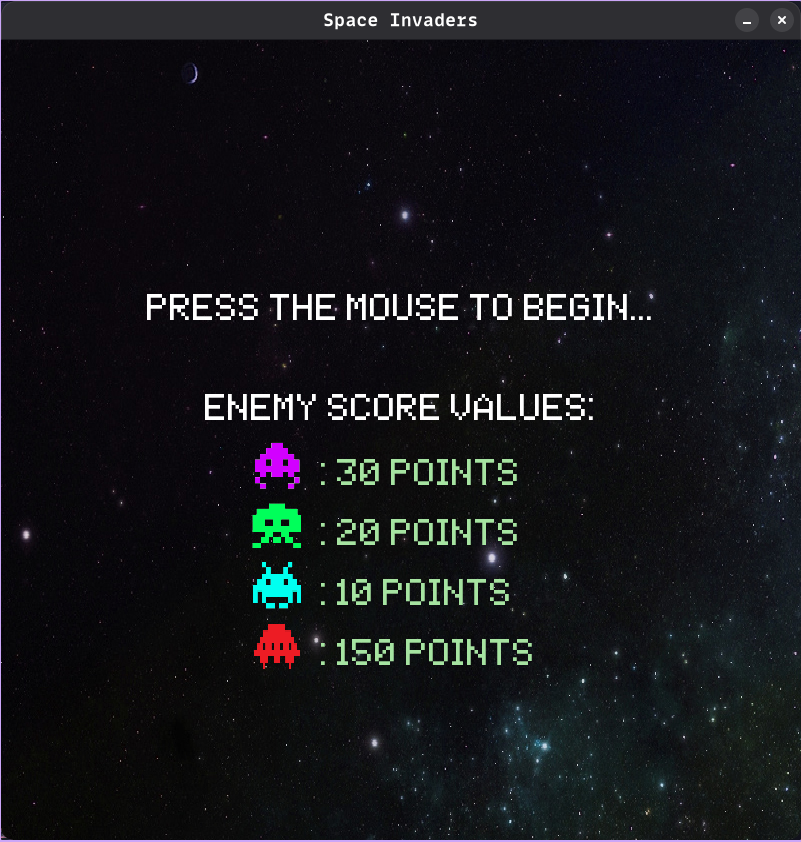
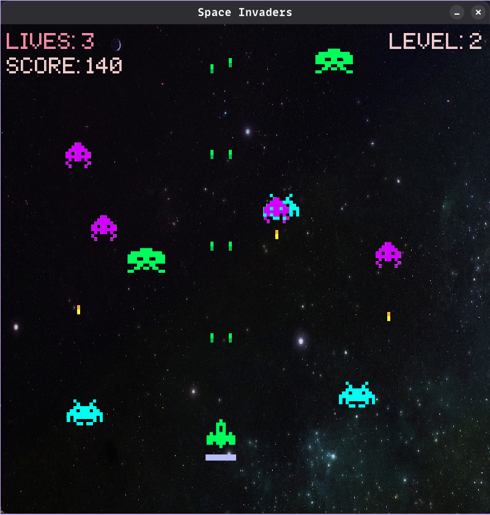
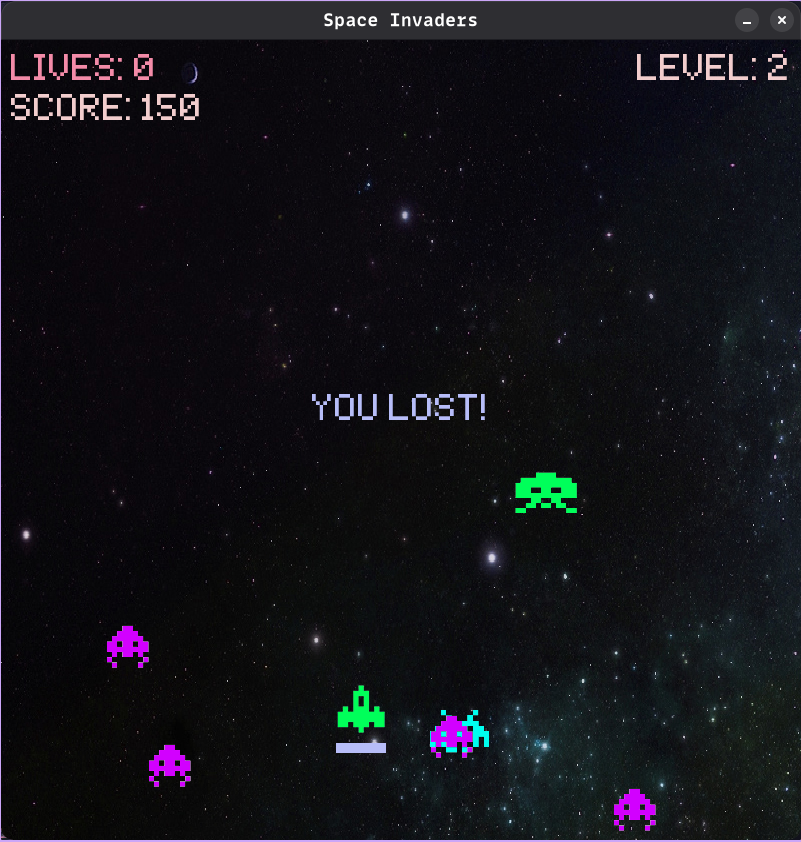

# Cosmic Invaders

A classic Space Invaders-style arcade game built with Python and Pygame.

## Overview

Cosmic Invaders is a modern reimagining of the iconic Space Invaders arcade game. Defend Earth from waves of alien spaceships, avoid their lasers, and earn points by destroying enemy vessels. The game features multiple enemy types, each with unique point values, and includes special appearances by the elusive mystery ship worth massive bonus points!

## Features

- **Multiple Enemy Types**: Purple, blue, green, and mystery ships with different point values
- **Level Progression**: Increasingly difficult waves of enemies
- **Sound Effects**: Immersive arcade-style audio for shooting, explosions, and more
- **Visual Effects**: Colorful explosions when ships are destroyed
- **Health System**: Player ship with health bar and lives counter
- **Scoring System**: Earn points by destroying different enemy ships

## Requirements

- Python 3.x
- Pygame library

## Installation

1. Clone the repository:
   ```
   git clone https://github.com/hoainam1401/cosmic-invaders.git
   cd cosmic-invaders
   ```

2. Install dependencies:
   ```
   pip install pygame
   ```

3. Run the game:
   ```
   python main.py
   ```

## Controls

- **Arrow Keys**: Move the player's ship (up, down, left, right)
- **Space**: Fire lasers
- **Mouse Click**: Start the game from the title screen

## Game Mechanics

- **Enemies**: Different colored ships have different point values:
  - Purple Ship: 30 points
  - Green Ship: 20 points
  - Blue Ship: 10 points
  - Mystery Ship: 150 points (appears every 3 levels)

- **Level Progression**: Each level adds more enemies to the wave, increasing the difficulty

- **Lives**: You start with 10 lives, losing one when an enemy reaches the bottom of the screen

- **Health**: Your ship has a health bar that decreases when hit by enemy lasers or colliding with enemy ships

## Project Structure

```
cosmic-invaders/
├── main.py          # Main game code
├── images/          # Ship and asset images
│   ├── enemy1_1.png
│   ├── enemy2_1.png
│   ├── enemy3_1.png
│   ├── mystery.png
│   └── ...
├── sounds/          # Sound effects
│   ├── invaderkilled.wav
│   ├── mysteryentered.wav
│   └── ...
└── fonts/           # Game fonts
    └── space_invaders.ttf
```

## Credits

- Game developed with Python and Pygame
- Sound effects and graphics inspired by the classic Space Invaders game
- Font: Space Invaders TTF

## Images



